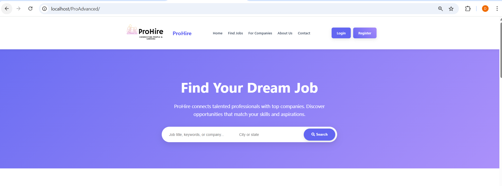
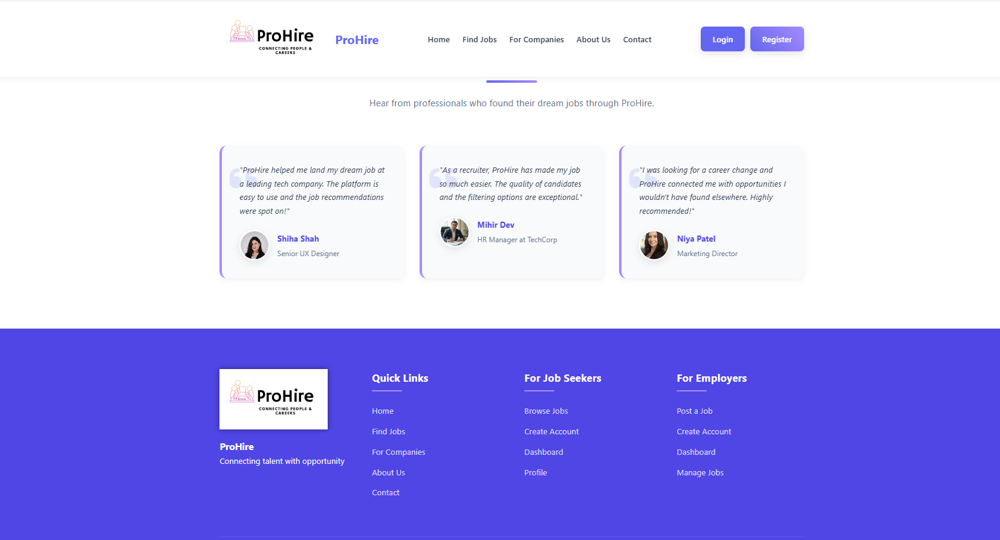

# ProHire---An-Online-Job-Protal

ProHire is a comprehensive, full-stack web application designed to bridge the gap between job seekers and employers. Built using the **LAMP stack** (Linux, Apache, MySQL, PHP), it provides a robust platform for job seekers to find opportunities and for employers to manage their hiring pipeline efficiently.

---
## 📸 Project Gallery
| Home Hero Section | Features Overview |
| :---: | :---: |
|  |  |
| **Featured Job Listings** | **Testimonials & Footer** |
|  |  |

## 🛠️ Tech Stack
* **Frontend:** HTML5, CSS3, JavaScript (Vanilla)
* **Backend:** PHP (Server-side logic and session management)
* **Database:** MySQL (Relational database design)
* **Server Environment:** XAMPP / WAMP / MAMP
* **Configuration:** `.htaccess` for clean URL routing and security

---

## 📁 Project Structure & Hierarchy

### 📂 Core Directories
* **`/admin`**: Management suite for platform statistics, users, companies, and jobs.
* **`/assets`**: Centralized storage for CSS, JS, images (logos, testimonials), and user resumes.
* **`/company`**: Employer portal for job posting, application tracking, and profile management.
* **`/includes`**: Essential backend logic including database configuration (`config.php`) and authentication guards.
* **`/user`**: Candidate-side interface for searching jobs, tracking applications, and saving listings.
* **`/logs`**: Contains `error.log` for debugging and system tracking.

### 📄 Root Files
* `index.php`: The main landing page.
* `login.php` / `register.php` / `logout.php`: Complete authentication system.
* `db.sql`: The primary database schema file for system setup.
* `search.php` & `job_details.php`: Global search and job view logic.

---

## 🌟 Key Features by Role

### 👤 Job Seeker (User)
* **Profile Management:** Edit personal details, skills, and upload resumes to `/assets/resumes`.
* **Job Discovery:** Advanced search with filters and detailed job views.
* **Application Tracking:** Apply for jobs and monitor status (Applied / Shortlisted / Rejected).
* **Saved Jobs:** Save interesting listings to a personalized "Saved Jobs" list.

### 🏢 Employer (Company)
* **Job Management:** Create, edit, and delete job postings with full control.
* **Hiring Pipeline:** View all incoming applications and update candidate statuses.
* **Company Profile:** Manage public-facing company details and logos.

### 🔐 Admin
* **System Moderation:** Full control to block or delete users and companies.
* **Content Oversight:** Moderate all job postings and view detailed resumes.
* **Dashboard:** High-level view of platform statistics and recent activities.

---

## 📋 Local Setup Instructions

1. **Download:** Clone this repository or download the ZIP and extract it.
2. **Server Placement:** Move the project folder into your local server directory (e.g., `C:/xampp/htdocs/proadvanced/`).
3. **Database Setup:**
   * Open **phpMyAdmin**.
   * Create a new database named `prohire_db`.
   * Import the **`db.sql`** file located in the root directory.
4. **Configuration:**
   * Navigate to `/includes/config.php`.
   * Update the database credentials (username, password, host) to match your local environment.
5. **Launch:** Start Apache and MySQL in your control panel and visit `http://localhost/proadvanced/index.php`.

---

## 🤝 Contact
If you have any questions or want to collaborate on this project, feel free to reach out via my GitHub profile!
